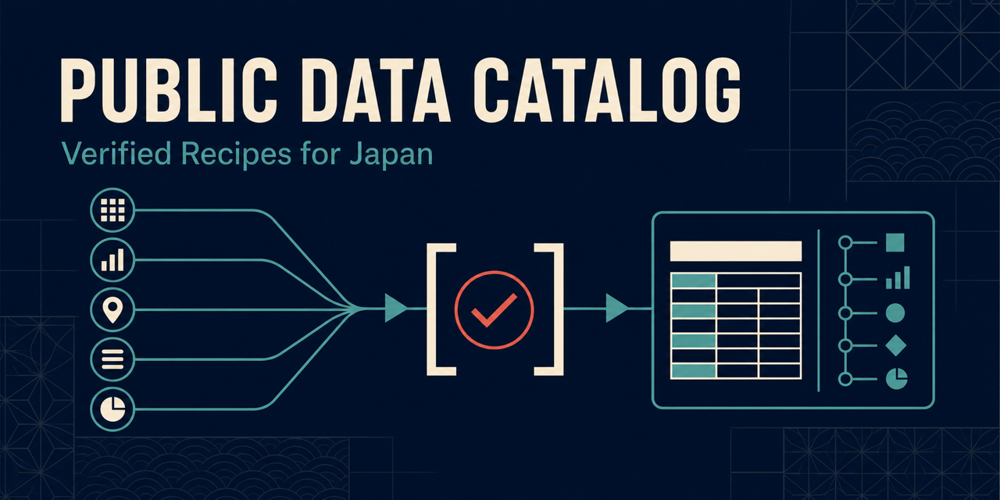

# Public Data Catalog — Verified Recipes for Japan

[日本語](./README.md)

[](https://github.com/yhay81/public-data-catalog/actions/workflows/ci.yml)
[](https://github.com/yhay81/public-data-catalog/actions/workflows/recipe-probes.yml)
[](./LICENSE)



Japanese-first, tested retrieval recipes that help developers and AI agents move from a concrete public-data question to a small, reproducible, attributable result.

This is not another exhaustive link list or a mirror of government data. Each recipe keeps a bounded request, response assertions, extracted values, interpretation notes, provenance, license, and verification date together.

## Try it in one minute

The runner has no third-party runtime dependencies and requires Python 3.11 or newer.

```sh
git clone --depth 1 https://github.com/yhay81/public-data-catalog.git
cd public-data-catalog
python3 scripts/recipe_tool.py run tokyo-population-2023 --format text
```

The text view makes the value, context, source, and license easy to inspect. The default output is full JSON for agents and downstream tools:

```sh
python3 scripts/recipe_tool.py run tokyo-population-2023
```

Published values can be revised by the source. Every successful result includes the retrieval time, final request URL, interpretation notes, official evidence, attribution text, and license URL.

## Verified recipes

| ID | Question | Source | Authentication |
| --- | --- | --- | --- |
| `tokyo-population-2023` | What was Tokyo's total population in 2023? | Statistics Dashboard | None |
| `japan-unemployment-rate-2023` | What was Japan's unemployment rate in 2023? | Statistics Dashboard | None |
| `egov-population-dataset-search` | Can e-Gov find datasets about population? | e-Gov Data Portal | None |
| `world-bank-japan-population-2023` | What was Japan's 2023 population according to the World Bank? | World Bank | None |
| `usgs-noto-earthquake-2024` | How does USGS record the 2024 Noto Peninsula earthquake? | USGS | None |

List and inspect the available contracts:

```sh
python3 scripts/recipe_tool.py list
python3 scripts/recipe_tool.py list --json
python3 scripts/recipe_tool.py show usgs-noto-earthquake-2024
```

## Trust boundary

- Recipes use reviewed HTTPS GET requests only.
- Request and redirect hosts must be explicitly allowlisted and resolve to public addresses.
- Responses are bounded to at most 1 MB, with a timeout and one conservative retry.
- Assertions check identifiers and response structure instead of freezing legitimately revisable values.
- Results retain source, license, credit, interpretation, and verification metadata.
- A public endpoint is not automatically unrestricted data. Dataset- and record-level terms still apply.

See the [recipe format](./docs/recipe-format.md), [security policy](./SECURITY.md), and current [verification status](./docs/status.md).

## Validation

```sh
python3 scripts/validate_catalog.py
python3 -m unittest discover -s tests -v
python3 scripts/recipe_tool.py check
```

Pull-request CI performs local contract and unit checks. A separate weekly and manually dispatchable workflow runs the bounded live probes.

## Contributing

Start with a concrete question, not a request to increase the source count.

1. Read [CONTRIBUTING.md](./CONTRIBUTING.md) and the [recipe format](./docs/recipe-format.md).
2. Confirm official documentation, licensing, and attribution requirements.
3. Add one small, read-only recipe for one question.
4. Run local validation and the affected live probe.
5. Record the result, evidence, units, identifiers, and interpretation caveats.

An independent onboarding test is also a valuable first contribution. Follow the [external execution protocol](./docs/external-test-protocol.md) and join [Issue #2](https://github.com/yhay81/public-data-catalog/issues/2).

The project's differentiation and evidence gates are documented in [strategy](./docs/strategy.md) and the [roadmap](./docs/roadmap.md). For usage and reporting routes, see [SUPPORT.md](./SUPPORT.md).

## License

The repository's structured metadata, code, and documentation are provided under the MIT License. Data and services referenced by the catalog remain subject to their own official terms.
