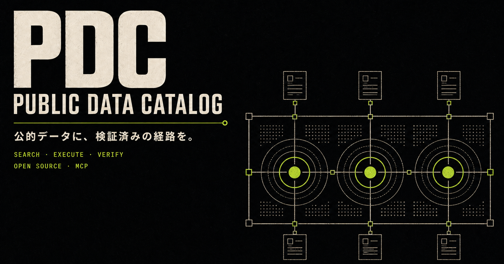

# Public Data Catalog — Verified Recipes for Japan

[English](./README.en.md)

[](https://github.com/yhay81/public-data-catalog/actions/workflows/ci.yml)
[](https://github.com/yhay81/public-data-catalog/actions/workflows/recipe-probes.yml)
[](./LICENSE)



日本の公共データを中心に、AIや開発者が**具体的な問いから、根拠付きで再現可能な最初の取得まで**進むための、テスト済みレシピ集です。

ブランドサイト: [PDC — 公的データに、検証済みの経路を。](https://public-data-catalog-mcp.yusuke8h.workers.dev/) · [ブランドガイド](./docs/brand.md)

単なるリンク集ではありません。実行可能な小さなリクエスト、期待する応答、単位・コード・改訂上の注意、出典、ライセンス、確認日を一緒に管理します。

_Japanese-first, tested retrieval recipes for getting small, attributable results from official public data._

## まず1分で試す

依存パッケージは不要です。Python 3.11以上で実行できます。

```sh
git clone --depth 1 https://github.com/yhay81/public-data-catalog.git
cd public-data-catalog
python3 scripts/recipe_tool.py run tokyo-population-2023 --format text
```

2026年7月24日の検証では、統計ダッシュボードから次のような短い結果を取得します。

```text
質問: 2023年の東京都の総人口は何人か。
結果:
- 総人口: 14086000 人
- 地域コード: 13000
- 時間コード: 2023CY00
- 速報・確報コード: 0
...
情報源: statistics-dashboard-api
出典表記: 出典：統計ダッシュボード（https://dashboard.e-stat.go.jp/）
ライセンス: https://dashboard.e-stat.go.jp/static/terms
```

値は公式ソース側で改訂される可能性があります。実行結果には、取得日時、実際のリクエストURL、解釈上の注意、出典、ライセンスも含まれます。

## AIエージェントから使う

公開MCPサーバーは、現在標準のStreamable HTTPで接続できます。

```json
{
  "mcpServers": {
    "public-data-catalog": {
      "url": "https://public-data-catalog-mcp.yusuke8h.workers.dev/mcp"
    }
  }
}
```

公開するツールは、情報源と契約を探す `search_data`、レビュー済み契約を実行する `execute`、実行レシートの整合性を確認する `verify` の3つです。任意URL、任意SQL、任意コードは実行しません。Cloudflare Workers上の参照サービスなので可用性保証はありません。

ローカルMCPとして使う場合はNode.js 24以上で `npm ci && npm run mcp` を実行します。実装と接続境界は [アーキテクチャ](./docs/architecture.md)、MCP Registry用の機械可読情報は [`server.json`](./server.json) にあります。

## 使い方

```sh
# 利用できる質問を見る
python3 scripts/recipe_tool.py list

# AIや別ツールから読めるJSON一覧
python3 scripts/recipe_tool.py list --json

# 1つのレシピを実行する
python3 scripts/recipe_tool.py run japan-unemployment-rate-2023

# 検証済み範囲内で年を指定する
python3 scripts/recipe_tool.py run tokyo-population-by-year --param year=2025

# 人が読みやすい短い形式
python3 scripts/recipe_tool.py run japan-unemployment-rate-2023 --format text

# 全レシピの応答契約を確認する
python3 scripts/recipe_tool.py check

# 保存したJSON結果の整合性を確認する
python3 scripts/recipe_tool.py verify result.json
```

`run` の既定出力は、AIや後続処理で扱える完全なJSONです。成功結果には応答と抽出結果のSHA-256を束ねた整合性確認用の実行レシートが付きます。`--format text` は値・解釈・出典・ライセンスを人が素早く確認するための表示です。

## 検証済みレシピ

| ID | 質問 | 情報源 | 認証 |
| --- | --- | --- | --- |
| `tokyo-population-by-year` | 2015–2025年から指定した年の東京都の総人口は何人か | 統計ダッシュボード | 不要 |
| `tokyo-population-2023` | 2023年の東京都の総人口は何人か | 統計ダッシュボード | 不要 |
| `japan-unemployment-rate-2023` | 2023年の日本の完全失業率は何%か | 統計ダッシュボード | 不要 |
| `egov-population-dataset-search` | e-Govで人口データセットを探せるか | e-Govデータポータル | 不要 |
| `world-bank-japan-population-2023` | 世界銀行による2023年の日本の総人口は何人か | World Bank | 不要 |
| `usgs-noto-earthquake-2024` | USGSは能登半島地震をどう記録しているか | USGS | 不要 |

レシピの構造と安全上の制約は [docs/recipe-format.md](./docs/recipe-format.md)、現在の検証状況は [docs/status.md](./docs/status.md) にあります。初見での再現性を検証する場合は [外部実行テスト手順](./docs/external-test-protocol.md) を使い、[参加用Issue #2](https://github.com/yhay81/public-data-catalog/issues/2) から結果を共有してください。

## 情報源プロファイル

| ID | 分野 | 地域 | 認証 | 主な形式 |
| --- | --- | --- | --- | --- |
| `estat-api` | 日本の公的統計 | 日本 | 要登録・アプリID | JSON / XML / CSV |
| `statistics-dashboard-api` | 日本の主要統計 | 日本・世界 | 不要 | JSON / JSON-stat / XML / CSV |
| `open-meteo` | 天気・気候 | 世界 | 不要（無料枠） | JSON / CSV / XLSX |
| `world-bank-indicators` | 開発・経済統計 | 世界 | 不要 | JSON / XML |
| `gbif-api` | 生物多様性・出現記録 | 世界 | 多くの検索は不要 | JSON |
| `us-census-api` | 人口・経済・住宅統計 | 米国 | 任意のAPIキー | JSON |
| `openalex-api` | 学術文献・研究者・機関 | 世界 | APIキー（無料） | JSON |
| `egov-data-portal` | 日本政府オープンデータ | 日本 | カタログAPIは原則不要 | JSON / CSV / XML |
| `usgs-earthquake-api` | 地震・災害観測 | 世界 | 不要 | GeoJSON / CSV / XML |
| `overpass-api` | 地理空間・地図要素 | 世界 | 不要（共有インスタンス） | JSON / XML / CSV |
| `copernicus-climate-data-store` | 気候再解析・環境 | 世界 | 登録・APIトークン | GRIB / NetCDF / CSV / Zarr |
| `europe-pmc-api` | 生命科学文献・注釈 | 世界 | 不要 | JSON / XML |
| `open-food-facts-api` | 食品・栄養・成分 | 世界 | 読み取りは不要 | JSON / CSV / JSONL |

`catalog.json` が情報源プロファイルの正本で、構造は [catalog.schema.json](./catalog.schema.json) で定義しています。レシピは [`recipes/`](./recipes/) の各JSONファイルが正本です。エージェントや静的配布向けの統合バンドル [`generated/catalog.bundle.json`](./generated/catalog.bundle.json) と、標準カタログ連携向けの [DCAT 3 JSON-LD](./generated/catalog.dcat.jsonld) はそこから決定的に生成します。

## 設計原則

- **問いから始める** — 分野の穴埋めだけを理由に情報源を増やしません。
- **最小取得** — 大量データをミラーせず、問いに必要な範囲だけを取得します。
- **根拠を残す** — 値と一緒に、出典、ライセンス、単位、コード、確認日を返します。
- **失敗を検出する** — HTTP 200だけでなく、主要フィールドと識別子まで確認します。
- **安全に限定する** — 初期レシピはHTTPSのGET、明示的なホスト、最大1 MBに制限します。

「公開されている」と「無条件に再利用できる」は同じではありません。データセット単位・レコード単位の条件、出典表示、商用利用制限、APIのレート制限を必ず確認してください。

## 検証

依存パッケージなしで、カタログとレシピの構造、URL、ID、列挙値、出典の対応、秘密情報らしきクエリパラメータを検査できます。

```sh
python3 scripts/validate_catalog.py
python3 -m unittest discover -s tests -v
python3 scripts/recipe_tool.py check
npm ci
npm run artifacts:check
npm run typecheck
npm test
```

通常のプルリクエストでは構造と単体テストだけを実行し、外部APIへのprobeは週次および手動実行に分けています。

## 貢献

新しい情報源の名前ではなく、「再現可能にしたい具体的な問い」をIssueまたはプルリクエストで提案してください。

1. [CONTRIBUTING.md](./CONTRIBUTING.md) と [レシピ仕様](./docs/recipe-format.md) を読む
2. 公式ドキュメントと利用条件を確認する
3. 1つの問いに対する、小さく読み取り専用のレシピを追加する
4. ローカル検証と対象レシピのprobeを実行する
5. 結果、根拠、注意点をプルリクエストに残す

目的と非目標は [PURPOSE.md](./PURPOSE.md)、競合との役割分担と採用戦略は [docs/strategy.md](./docs/strategy.md)、今後のゲートは [docs/roadmap.md](./docs/roadmap.md) にあります。利用上の質問や問題の報告先は [SUPPORT.md](./SUPPORT.md) を参照してください。

## ライセンス

このリポジトリの構造化メタデータと文書はMIT Licenseで提供します。カタログに登録された各サービス・データの利用条件は、各項目の `license` と公式ソースに従ってください。
